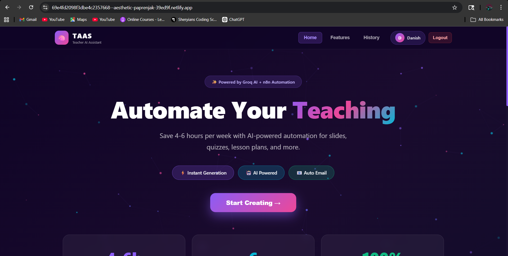
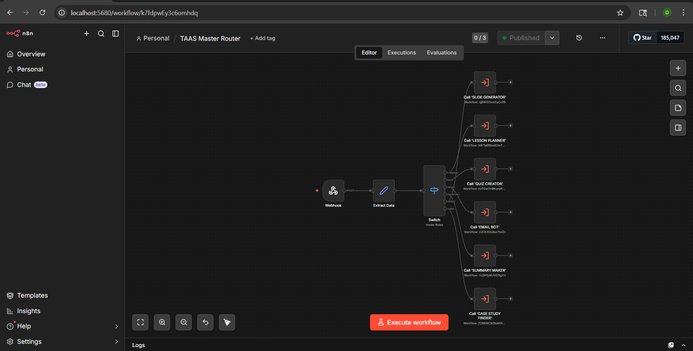
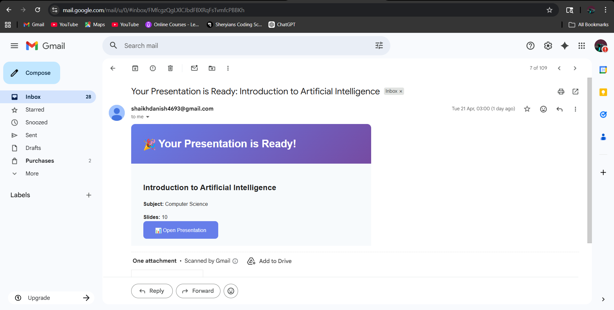
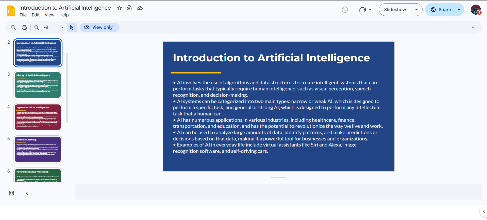

# 🧠 TAAS — Teacher AI Support System

<div align="center">


<br/><br/>

[](https://n8n.io)
[](https://groq.com)
[](https://react.dev)
[](https://developers.google.com)
[](https://gsap.com)
[](https://netlify.com)
[](./LICENSE)
[]()

<br/>

> **An AI-powered automation system that helps college teachers save 4–6 hours per week by automating their most repetitive academic tasks — instantly, professionally, and for free.**

<br/>

[🌐 Live Demo](https://69e4fd2098f3dbe4c2357668--aesthetic-paprenjak-39ed9f.netlify.app) · [📖 How It Works](#-how-it-works) · [⚙️ Setup Guide](#%EF%B8%8F-installation--setup) · [🎬 Video Demo](#-video-demo)

</div>

---

## 📸 Project Screenshots

<div align="center">

### 🏠 Landing Page — Live on Netlify

*Glassmorphism UI with GSAP animations, particle background, and responsive design*

<br/>

### ⚙️ n8n Master Router Workflow

*7 connected workflows — Webhook → Extract Data → Switch → 6 Sub-workflows*

<br/>

### 📧 Email Delivery — Presentation Ready

*Professional HTML email with Google Slides link delivered to inbox automatically*

<br/>

### 📊 AI-Generated Google Slides Presentation

*10-slide presentation on "Introduction to Artificial Intelligence" — generated in under 60 seconds*

<br/>

### ✍️ AI-Generated Quiz Document

*Complete quiz with MCQs, short answers, instructions, and answer key — auto-saved to Google Docs*

</div>

---

## 📌 Table of Contents

- [Overview](#-overview)
- [Features](#-features)
- [Tech Stack](#-tech-stack)
- [System Architecture](#-system-architecture)
- [Live Demo](#-live-demo)
- [Installation & Setup](#%EF%B8%8F-installation--setup)
- [n8n Workflow Setup](#-n8n-workflow-setup)
- [API Reference](#-api-reference)
- [Project Structure](#-project-structure)
- [Roadmap](#-roadmap)
- [Team](#-team)
- [License](#-license)

---

## 🎯 Overview

**TAAS (Teacher AI Support System)** is a final year major project developed at **Rizvi College of Engineering, University of Mumbai (2026)** that solves a real and pressing problem — teachers spending hours every week on repetitive content creation instead of actual teaching.

TAAS automates 6 core academic tasks using a combination of **n8n workflow automation**, **Groq AI (LLaMA 3.3-70b)**, and **Google Workspace APIs**. A teacher simply enters a topic and their email address, clicks one button, and receives a professionally generated document delivered directly to their inbox within 60 seconds.

### 🎓 The Problem
> Teachers spend **4–6 hours per week** creating slides, quizzes, lesson plans, and student emails — time that could be spent with students.

### 💡 The Solution
> TAAS automates all of it. One form. One click. Professional results delivered to your email in under 60 seconds.

---

## ✨ Features

| Feature | Description | Output |
|---------|-------------|--------|
| 📊 **Slide Generator** | Creates complete 10-slide presentations from any topic | Google Slides |
| 📚 **Lesson Planner** | Generates structured lesson plans with objectives, activities & assessments | Google Docs |
| ✍️ **Quiz Creator** | Builds full quizzes — MCQ, short & long answers + complete answer key | Google Docs |
| 📧 **Email Bot** | Drafts professional student/parent emails automatically | Gmail Delivery |
| 📄 **Summary Maker** | Converts lecture topics into clean summaries with review questions | Google Docs |
| 🔍 **Case Study Finder** | Generates 3–4 real-world case studies with discussion questions | Google Docs |

### Additional Highlights

- ⚡ **60-second generation** — from input to inbox
- 🔄 **7 modular n8n workflows** — fully automated pipeline
- 🎨 **3D animated frontend** — GSAP-powered glassmorphism UI deployed on Netlify
- 📱 **Fully responsive** — works on mobile, tablet & desktop
- 🆓 **Free to run** — built entirely on free-tier tools
- 📧 **Auto email delivery** — all outputs sent via Gmail with styled HTML emails
- 🗂️ **Google Drive integration** — all files auto-saved and shared with a single link

---

## 🛠️ Tech Stack

### Frontend
| Technology | Version | Purpose |
|------------|---------|---------|
| React | 18 | UI framework |
| GSAP | 3.12 | Animations & micro-interactions |
| Tailwind CSS | 3 | Utility-first styling |
| Canvas API | — | Particle background animation |
| Netlify | — | Frontend deployment |

### Automation & AI Backend
| Technology | Purpose |
|------------|---------|
| n8n (self-hosted) | Workflow automation engine — 7 workflows |
| Groq AI (LLaMA 3.3-70b) | Ultra-fast AI content generation |
| Google Slides API | Presentation creation & formatting |
| Google Docs API | Document creation & content insertion |
| Google Drive API | File storage, sharing & permissions |
| Gmail API | Styled HTML email delivery |

### Authentication & APIs
| Technology | Purpose |
|------------|---------|
| Google OAuth 2.0 | Authentication for all Google APIs |
| n8n Webhooks | REST API endpoint layer |
| HTTP Request nodes | Groq API calls with Header Auth |

---

## 🏗️ System Architecture

```
┌────────────────────────────────────────────────────────────────┐
│              FRONTEND — React App (Netlify)                    │
│   User fills form → Selects task → Clicks Generate            │
└────────────────────────────┬───────────────────────────────────┘
                             │  POST /webhook/taas-submit
                             ▼
┌────────────────────────────────────────────────────────────────┐
│                   n8n MASTER ROUTER                            │
│    Webhook → Extract Data → Switch (routes by task type)       │
└──────┬───────────┬──────────┬────────┬──────────┬─────────────┘
       │           │          │        │          │
       ▼           ▼          ▼        ▼          ▼
  📊 Slide    📚 Lesson   ✍️ Quiz  📧 Email  📄 Summary
  Generator   Planner    Creator    Bot      Maker
                                         🔍 Case Studies
       │
       ▼
┌──────────────────┐    ┌─────────────────────┐    ┌────────────┐
│  Groq AI API     │ →  │  Google APIs         │ →  │   Gmail    │
│  LLaMA 3.3-70b   │    │  Docs / Slides / Drive│   │  Delivery  │
└──────────────────┘    └─────────────────────┘    └────────────┘
```

### Request Data Flow
```
1.  Teacher enters topic, subject, grade & email in the React form
2.  Frontend POSTs JSON payload to n8n webhook
3.  Master Router extracts data and routes to correct sub-workflow
4.  Sub-workflow sends an optimized prompt to Groq AI
5.  AI generates structured, curriculum-aligned content
6.  n8n creates a Google Doc or Slides file via API
7.  File permissions set to "anyone with link can view"
8.  Gmail node sends a styled HTML email with the Drive link
9.  Teacher receives professional content in their inbox ✅
```

---

## 🌐 Live Demo

> **🚀 Try it now:** [TAAS Live on Netlify](https://69e4fd2098f3dbe4c2357668--aesthetic-paprenjak-39ed9f.netlify.app)

**Note:** For the live demo to generate content, you need n8n running locally with the webhooks active. The UI is fully functional for demonstration purposes.

---

## 🎬 Video Demo

> *(Coming soon — watch this space)*

---

## ⚙️ Installation & Setup

### Prerequisites

Make sure you have the following before starting:

- [ ] [Node.js](https://nodejs.org) v18+ installed
- [ ] [n8n](https://n8n.io) installed (self-hosted)
- [ ] [Google Cloud Console](https://console.cloud.google.com) account with APIs enabled
- [ ] [Groq API key](https://console.groq.com) — free tier available
- [ ] Gmail account for email delivery

---

### Step 1: Clone the Repository

```bash
git clone https://github.com/Danish1309/taas.git
cd taas
```

---

### Step 2: Enable Google APIs

1. Go to [Google Cloud Console](https://console.cloud.google.com)
2. Create a new project: **"TAAS Automation"**
3. Enable these APIs:
   ```
   ✅ Google Slides API
   ✅ Google Docs API
   ✅ Google Drive API
   ✅ Gmail API
   ```
4. Go to **Credentials** → **Create OAuth 2.0 Client ID**
   - Application type: **Web application**
   - Authorized redirect URI: `http://localhost:5680/rest/oauth2-credential/callback`
5. Copy your **Client ID** and **Client Secret**

---

### Step 3: Get Your Groq API Key

```bash
# 1. Go to https://console.groq.com
# 2. Sign up for a free account
# 3. Navigate to API Keys → Create API Key
# 4. Copy your key (starts with gsk_...)
```

---

### Step 4: Install and Start n8n

```bash
# Install n8n globally
npm install -g n8n

# Start n8n
n8n start

# n8n opens at → http://localhost:5678 or http://localhost:5680
```

---

### Step 5: Add Credentials in n8n

Go to **Settings → Credentials** and add the following:

**1. Groq API (Header Auth)**
```
Type:         Header Auth
Header Name:  Authorization
Value:        Bearer YOUR_GROQ_API_KEY_HERE
```

**2. Google OAuth2 API**
```
Type:          Google OAuth2 API
Client ID:     YOUR_GOOGLE_CLIENT_ID
Client Secret: YOUR_GOOGLE_CLIENT_SECRET
Scopes:        Google Drive, Google Docs, Google Slides
```

**3. Gmail OAuth2**
```
Type:          Gmail OAuth2
Client ID:     YOUR_GOOGLE_CLIENT_ID
Client Secret: YOUR_GOOGLE_CLIENT_SECRET
```

> Note down each **Credential ID** from the URL after saving — you'll need them in the workflow JSONs.

---

### Step 6: Import n8n Workflows

Import all 7 JSON files from `/n8n-workflows/` — **in this exact order:**

```
1. taas-slide-generator.json
2. taas-lesson-planner.json
3. taas-quiz-creator.json
4. taas-email-bot.json
5. taas-summary-maker.json
6. taas-case-study-finder.json
7. taas-master-router.json    ← Import LAST
```

**For each workflow:**
1. Go to **Workflows** → **+** → **⋮** → **Import from File**
2. Paste the JSON content
3. Update credential IDs inside each node
4. **Save** and note the **Workflow ID** from the URL
5. Do NOT activate yet

**Update the Master Router:**
- Open `taas-master-router.json`
- Paste the correct Workflow ID into each "Call" node
- Save → Activate all 7 workflows ✅

---

### Step 7: Run the Frontend

```bash
# Navigate to frontend
cd frontend

# Install dependencies
npm install

# Start dev server
npm start

# Opens at → http://localhost:3000
```

---

### Step 8: Test End-to-End

```bash
# Replace YOUR_PORT and YOUR_EMAIL
curl -X POST http://localhost:5680/webhook/taas-submit \
  -H "Content-Type: application/json" \
  -d '{
    "task": "slides",
    "topic": "Introduction to Artificial Intelligence",
    "subject": "Computer Science",
    "grade": "Undergraduate",
    "email": "YOUR_EMAIL@gmail.com",
    "details": "Focus on types of AI and real-world applications"
  }'
```

**Expected response:**
```json
{ "message": "Workflow was started" }
```

Check your inbox in 60 seconds — you should receive a styled email with a Google Slides link! 🎉

---

## 🔌 API Reference

### Submit Task

| Field | Type | Required | Description |
|-------|------|----------|-------------|
| `task` | string | ✅ | Tool type (see values below) |
| `topic` | string | ✅ | Main topic for content generation |
| `subject` | string | ❌ | Subject area (e.g. Computer Science) |
| `grade` | string | ❌ | Grade or level (e.g. Undergraduate) |
| `email` | string | ✅ | Email to receive the output |
| `details` | string | ❌ | Any additional instructions |

**Task Values:**

| Value | Tool | Output |
|-------|------|--------|
| `slides` | Slide Generator | Google Slides (10 slides) |
| `lesson` | Lesson Planner | Google Docs |
| `quiz` | Quiz Creator | Google Docs (with answer key) |
| `email` | Email Bot | Gmail delivery |
| `summary` | Summary Maker | Google Docs |
| `case` | Case Study Finder | Google Docs |

### Example Requests

```bash
# Generate a Quiz
curl -X POST http://localhost:5680/webhook/taas-submit \
  -H "Content-Type: application/json" \
  -d '{"task":"quiz","topic":"Newton'\''s Laws","subject":"Physics","grade":"Grade 11","email":"teacher@school.com","details":"Include application-based questions"}'

# Generate a Lesson Plan
curl -X POST http://localhost:5680/webhook/taas-submit \
  -H "Content-Type: application/json" \
  -d '{"task":"lesson","topic":"Photosynthesis","subject":"Biology","grade":"Grade 10","email":"teacher@school.com","details":"Include lab activities"}'
```

---

## 📁 Project Structure

```
taas/
│
├── 📂 frontend/                     # React web application
│   ├── public/
│   └── src/
│       ├── App.jsx                  # Root component with routing
│       ├── components/
│       │   ├── TaskCard.jsx         # 6 animated tool cards
│       │   ├── TaskForm.jsx         # Multi-field generation form
│       │   ├── LoginModal.jsx       # User login modal
│       │   ├── HistoryItem.jsx      # Request history entries
│       │   └── AnimatedBG.jsx       # Canvas particle background
│       ├── hooks/
│       │   └── useTaskSubmit.js     # API call + progress state
│       └── styles/
│           └── globals.css
│
├── 📂 n8n-workflows/                # All n8n workflow JSON files
│   ├── taas-master-router.json      # Entry point + router
│   ├── taas-slide-generator.json    # Slides workflow
│   ├── taas-lesson-planner.json     # Lesson plan workflow
│   ├── taas-quiz-creator.json       # Quiz workflow
│   ├── taas-email-bot.json          # Email workflow
│   ├── taas-summary-maker.json      # Summary workflow
│   └── taas-case-study-finder.json  # Case study workflow
│
├── 📂 docs/
│   └── screenshots/                 # Project screenshots
│       ├── landing-page.png
│       ├── n8n-master-router.png
│       ├── email-delivery.png
│       ├── generated-slides.png
│       └── generated-quiz.png
│
├── 📄 README.md
├── 📄 LICENSE
└── 📄 .gitignore
```

---

## 🗺️ Roadmap

### Completed ✅
- [x] 6 AI automation tools (Slides, Quiz, Lesson, Email, Summary, Case Study)
- [x] n8n Master Router with 7 workflows
- [x] Google Workspace full integration (Slides, Docs, Drive, Gmail)
- [x] GSAP-animated React frontend
- [x] Deployed live on Netlify
- [x] Styled HTML email delivery
- [x] Groq AI integration (LLaMA 3.3-70b)

### Upcoming 🔜
- [ ] JWT user authentication
- [ ] Usage analytics dashboard
- [ ] Personal request history
- [ ] Template library (save & reuse prompts)
- [ ] School admin panel (multi-teacher)
- [ ] Mobile app (React Native)
- [ ] Custom branding per school
- [ ] Multi-language content generation

---

## 👨‍💻 Team

<div align="center">

| | Name | Role | GitHub | College |
|-|------|------|--------|---------|
| 👨‍💻 | **Danish Shaikh** | Full Stack Developer & Project Lead | [@Danish1309](https://github.com/Danish1309) | Rizvi College of Engineering |

**Final Year Major Project**
Rizvi College of Engineering, University of Mumbai — 2026

</div>

---

## 🙏 Acknowledgements

- [n8n](https://n8n.io) — Open-source workflow automation platform
- [Groq](https://groq.com) — Ultra-fast LLaMA inference API
- [Google Workspace APIs](https://developers.google.com) — Docs, Slides, Drive & Gmail
- [GSAP](https://gsap.com) — Professional-grade animation library
- [React](https://react.dev) — Frontend UI framework
- [Netlify](https://netlify.com) — Frontend deployment & hosting

---

## 📄 License

This project is licensed under the **MIT License** — see the [LICENSE](./LICENSE) file for details.

---

<div align="center">

**Built with ❤️ by [Danish Shaikh](https://github.com/Danish1309)**

*Rizvi College of Engineering, University of Mumbai — Class of 2026*

<br/>

⭐ **If this project helped you, please give it a star!** ⭐

[](https://github.com/Danish1309/taas)
[](https://github.com/Danish1309/taas)

<br/>

*Saving teachers time, one automation at a time. 🚀*

</div>
